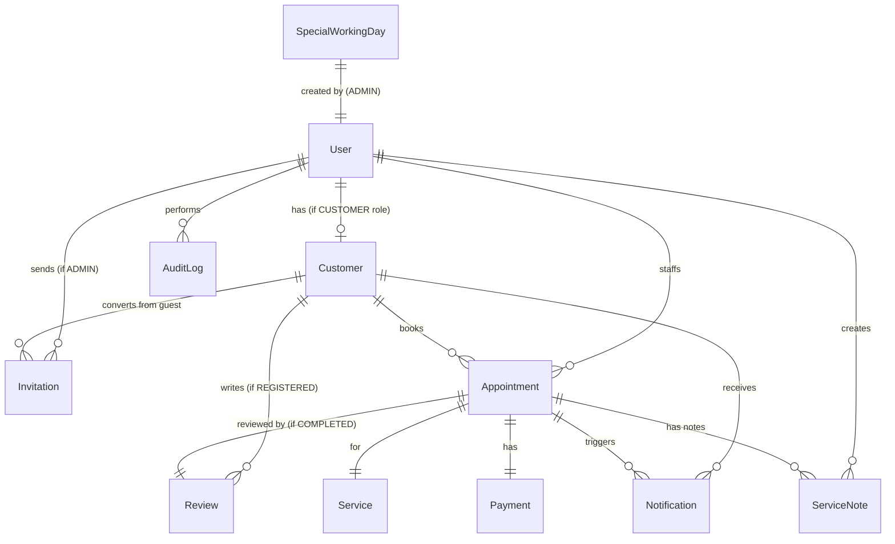

# Data Model: Appointment & Customer Management Suite

**Date**: 2025-10-02  
**Phase**: 1 (Design & Contracts)  
**Based on**: spec.md (Key Entities), research.md

## Overview

This document defines the database schema for the appointment and customer management system. The model supports:

- **Dual customer types**: Registered (User-linked) and Guest (standalone)
- **Appointment lifecycle**: PENDING → CONFIRMED → COMPLETED | CANCELLED | NO_SHOW
- **Audit trail**: Critical actions logged with 90-day retention before archival
- **Multi-channel notifications**: Email, SMS, Socket.io with per-event configuration
- **Offline payments**: Cash, bank transfer, POS card, veresiye (deferred payment)

## Entities

### 1. User

Authentication and authorization entity. Represents all system users (Admin, Staff, Customer).

**Fields**:

- `id`: String (CUID), primary key
- `email`: String, unique, required
- `phone`: String, unique, required (format: +90XXXXXXXXXX)
- `passwordHash`: String, required (bcrypt)
- `firstName`: String, required
- `lastName`: String, required
- `role`: Enum (ADMIN, STAFF, CUSTOMER), required
- `isActive`: Boolean, default true (for soft delete)
- `lastLoginAt`: DateTime, nullable
- `createdAt`: DateTime, default now
- `updatedAt`: DateTime, auto-update

**Relationships**:

- `customer`: 1:1 Customer (for CUSTOMER role)
- `sentInvitations`: 1:N Invitation (as inviter, Admin only)
- `appointments`: 1:N Appointment (as staff)
- `auditLogs`: 1:N AuditLog (as actor)
- `createdServiceNotes`: 1:N ServiceNote (as creator)

**Indexes**:

- `email` (unique)
- `phone` (unique)
- `role`

**Validation Rules** (from FR-004, FR-006):

- Email: valid format, unique across system
- Phone: E.164 format (+90XXXXXXXXXX), unique across system
- Password: min 8 chars, hashed with bcrypt (rounds=10)

---

### 2. Invitation

Invitation tokens for user registration (invitation-only system).

**Fields**:

- `id`: String (CUID), primary key
- `token`: String, unique, required (UUID v4)
- `email`: String, required
- `role`: Enum (STAFF, CUSTOMER), required (Admin creates users directly)
- `inviterId`: String, required (FK → User.id)
- `guestCustomerId`: String, nullable (FK → Customer.id, for guest-to-registered conversion)
- `isUsed`: Boolean, default false
- `expiresAt`: DateTime, required (createdAt + 72 hours)
- `usedAt`: DateTime, nullable
- `createdAt`: DateTime, default now

**Relationships**:

- `inviter`: N:1 User (Admin who sent invitation)
- `guestCustomer`: N:1 Customer (optional, for guest conversion)

**Indexes**:

- `token` (unique)
- `email`
- `expiresAt`
- `isUsed`

**Validation Rules** (from FR-002, FR-003):

- Token: UUID v4 format
- Expires 72 hours after creation
- Can be regenerated (new token) if expired

**State Transitions**:

```
Created (isUsed=false) → Used (isUsed=true, usedAt set)
Created → Expired (expiresAt < now, still isUsed=false)
```

---

### 3. Customer

Customer profile entity. Supports both registered (User-linked) and guest (standalone) customers.

**Fields**:

- `id`: String (CUID), primary key
- `userId`: String, nullable, unique (FK → User.id, for registered customers)
- `type`: Enum (REGISTERED, GUEST), required
- `firstName`: String, required
- `lastName`: String, required
- `email`: String, nullable (optional for guests)
- `phone`: String, required (format: +90XXXXXXXXXX)
- `birthDate`: DateTime, nullable
- `notes`: Text, nullable (staff notes about customer preferences)
- `totalAppointments`: Int, default 0 (denormalized for performance)
- `totalSpent`: Decimal, default 0 (denormalized for performance)
- `createdAt`: DateTime, default now
- `updatedAt`: DateTime, auto-update

**Relationships**:

- `user`: 1:1 User (nullable, for registered customers)
- `appointments`: 1:N Appointment
- `reviews`: 1:N Review (only for registered customers)
- `payments`: 1:N Payment (via appointments)
- `invitations`: 1:N Invitation (for guest conversion)

**Indexes**:

- `userId` (unique, nullable)
- `phone` (for guest matching, FR-019a)
- `type`
- `email` (nullable)

**Validation Rules** (from FR-027, FR-029):

- Phone: E.164 format, required
- Email: optional for guests, required for registered (via User)
- Type: REGISTERED requires userId, GUEST requires userId=null

**Business Rules**:

- Guest matching (FR-019a): When creating guest appointment, search by phone first to avoid duplicate guest records
- Guest → Registered conversion (FR-021, FR-022): Admin creates invitation with `guestCustomerId`, when user registers, update customer.userId and type=REGISTERED

---

### 4. Service

Service catalog (haircut, coloring, manicure, etc.).

**Fields**:

- `id`: String (CUID), primary key
- `name`: String, required
- `description`: Text, nullable
- `durationMinutes`: Int, required (for slot calculation, FR-056)
- `price`: Decimal, required
- `isActive`: Boolean, default true
- `createdAt`: DateTime, default now
- `updatedAt`: DateTime, auto-update

**Relationships**:

- `appointments`: 1:N Appointment

**Indexes**:

- `isActive`
- `name`

**Validation Rules**:

- `durationMinutes`: > 0, typically 15-180 min
- `price`: >= 0

---

### 5. WorkingHours

Normal salon working hours (per day of week).

**Fields**:

- `id`: String (CUID), primary key
- `dayOfWeek`: Int, required (0=Sunday, 1=Monday, ..., 6=Saturday)
- `openTime`: String, nullable (format: "HH:mm", e.g., "09:00")
- `closeTime`: String, nullable (format: "HH:mm", e.g., "19:00")
- `isClosed`: Boolean, default false (if true, openTime/closeTime ignored)
- `createdAt`: DateTime, default now
- `updatedAt`: DateTime, auto-update

**Indexes**:

- `dayOfWeek` (unique, only one record per day)

**Validation Rules** (from FR-054, FR-055):

- `dayOfWeek`: 0-6
- If `isClosed=true`, openTime and closeTime can be null
- If `isClosed=false`, openTime and closeTime required, closeTime > openTime

**Business Rules**:

- Slot calculation (FR-056): slots = (closeTime - openTime) / service.durationMinutes
- Only one record per `dayOfWeek` (enforced by unique constraint)

---

### 6. SpecialWorkingDay

Override hours for specific dates (holidays, special events).

**Fields**:

- `id`: String (CUID), primary key
- `date`: Date, required, unique
- `openTime`: String, nullable (format: "HH:mm")
- `closeTime`: String, nullable (format: "HH:mm")
- `isClosed`: Boolean, default false
- `description`: String, nullable (e.g., "Resmi Tatil", "Özel Etkinlik")
- `createdById`: String, required (FK → User.id, Admin)
- `createdAt`: DateTime, default now
- `updatedAt`: DateTime, auto-update

**Relationships**:

- `createdBy`: N:1 User (Admin)

**Indexes**:

- `date` (unique)

**Validation Rules** (from FR-057, FR-058, FR-059):

- `date`: unique, must be future or today
- If `isClosed=true`, openTime/closeTime null
- If `isClosed=false`, openTime and closeTime required

**Business Rules** (FR-059a):

- **Priority**: SpecialWorkingDay overrides WorkingHours for given date
- Slot calculation: if SpecialWorkingDay exists for date, use its hours; else use WorkingHours[dayOfWeek]

---

### 7. Appointment

Appointment/booking entity.

**Fields**:

- `id`: String (CUID), primary key
- `customerId`: String, required (FK → Customer.id)
- `staffId`: String, required (FK → User.id, Staff role)
- `serviceId`: String, required (FK → Service.id)
- `date`: Date, required
- `time`: String, required (format: "HH:mm")
- `status`: Enum (PENDING, CONFIRMED, COMPLETED, CANCELLED, NO_SHOW), required, default PENDING
- `creationMethod`: Enum (ONLINE_GUEST, ONLINE_REGISTERED, MANUAL), required
- `trackingCode`: String, nullable, unique (8-char alphanumeric, required for ONLINE_GUEST)
- `notes`: Text, nullable (general appointment notes, visible to customer)
- `cancellationReason`: String, nullable
- `createdAt`: DateTime, default now
- `updatedAt`: DateTime, auto-update

**Relationships**:

- `customer`: N:1 Customer
- `staff`: N:1 User (Staff role)
- `service`: N:1 Service
- `serviceNotes`: 1:N ServiceNote (post-completion notes, staff-only)
- `payment`: 1:1 Payment
- `review`: 1:1 Review (for registered customers)
- `notifications`: 1:N Notification

**Indexes**:

- `trackingCode` (unique, nullable)
- `customerId`
- `staffId`
- `date`, `time` (composite, for conflict detection)
- `status`
- `creationMethod`

**Validation Rules**:

- `trackingCode`: 8-char alphanumeric, required if creationMethod=ONLINE_GUEST (FR-013)
- `date`: must be >= today
- `time`: must be within working hours (WorkingHours or SpecialWorkingDay)
- `staffId`: must be Staff or Admin role

**State Transitions** (FR-023):

```
PENDING → CONFIRMED (staff approval, FR-016)
CONFIRMED → COMPLETED (after appointment)
CONFIRMED → CANCELLED (by staff/admin/customer)
COMPLETED → NO_SHOW (staff marks if customer didn't show)
PENDING → CANCELLED
```

**Business Rules**:

- Conflict detection (FR-016): Check if (staffId, date, time) combination exists with status ∈ {PENDING, CONFIRMED}
- Override (FR-017): Admin can force CONFIRMED despite conflict, must provide justification → audit log
- Manual appointments (FR-020): creationMethod=MANUAL, default status=CONFIRMED
- Tracking code (FR-014, FR-015): Guests can query by trackingCode, can request resend via SMS

---

### 8. ServiceNote

Post-appointment notes by staff (admin/staff only, not visible to customers).

**Fields**:

- `id`: String (CUID), primary key
- `appointmentId`: String, required (FK → Appointment.id)
- `content`: Text, required (max 1000 chars, FR-026a)
- `createdById`: String, required (FK → User.id, Staff/Admin)
- `createdAt`: DateTime, default now

**Relationships**:

- `appointment`: N:1 Appointment
- `createdBy`: N:1 User (Staff/Admin)

**Indexes**:

- `appointmentId`
- `createdAt` (for chronological display, FR-026c)

**Validation Rules** (from FR-026a):

- `content`: max 1000 characters
- `createdById`: must be Staff or Admin role

**Business Rules** (FR-026b):

- Visibility: only Admin and Staff can read
- Use case: Staff notes "Müşteri saç boyası konusunda hassas, patch test yapıldı" for next appointment

---

### 9. Payment

Offline payment tracking (no online payment integration).

**Fields**:

- `id`: String (CUID), primary key
- `appointmentId`: String, required, unique (FK → Appointment.id)
- `amount`: Decimal, required
- `method`: Enum (CASH, BANK_TRANSFER, POS_CARD, VERESIYE), required
- `paidAt`: DateTime, required
- `veresiyeDueDate`: Date, nullable (required if method=VERESIYE, FR-040)
- `veresiyeCollateral`: String, nullable (required if method=VERESIYE)
- `veresiyeResponsible`: String, nullable (required if method=VERESIYE, staff name)
- `recordedById`: String, required (FK → User.id, Staff/Admin who recorded payment)
- `createdAt`: DateTime, default now
- `updatedAt`: DateTime, auto-update

**Relationships**:

- `appointment`: 1:1 Appointment
- `recordedBy`: N:1 User (Staff/Admin)

**Indexes**:

- `appointmentId` (unique)
- `method`
- `veresiyeDueDate` (for veresiye tracking, FR-042)
- `recordedById`

**Validation Rules** (from FR-039, FR-040):

- `amount`: > 0
- If `method=VERESIYE`: veresiyeDueDate, veresiyeCollateral, veresiyeResponsible all required

**Business Rules**:

- Veresiye reminders (FR-042a): Job checks veresiyeDueDate - 3 days, veresiyeDueDate, veresiyeDueDate + N days
- Admin can disable reminders per customer (FR-042b): store in separate NotificationPreferences table or Customer.notes
- Audit log (FR-039a): payment create/update triggers audit log entry

---

### 10. Review

Customer reviews (registered customers only).

**Fields**:

- `id`: String (CUID), primary key
- `customerId`: String, required (FK → Customer.id, must be type=REGISTERED)
- `appointmentId`: String, required (FK → Appointment.id)
- `rating`: Int, required (1-5)
- `comment`: Text, nullable
- `status`: Enum (PENDING, APPROVED, DELETED), required, default PENDING
- `approvedById`: String, nullable (FK → User.id, Admin)
- `approvedAt`: DateTime, nullable
- `deletedById`: String, nullable (FK → User.id, Admin)
- `deletedAt`: DateTime, nullable
- `createdAt`: DateTime, default now
- `updatedAt`: DateTime, auto-update

**Relationships**:

- `customer`: N:1 Customer (REGISTERED only)
- `appointment`: N:1 Appointment
- `approvedBy`: N:1 User (Admin)
- `deletedBy`: N:1 User (Admin)

**Indexes**:

- `customerId`
- `appointmentId`
- `status`
- `rating`

**Validation Rules** (from FR-032, FR-033, FR-034):

- `customerId`: must reference REGISTERED customer
- `appointmentId`: must reference COMPLETED appointment
- `rating`: 1-5

**State Transitions**:

```
PENDING → APPROVED (Admin approval)
PENDING → DELETED (Admin deletion)
APPROVED → DELETED (Admin can delete later)
```

**Business Rules**:

- Only registered customers can review (FR-032)
- Admin approval required before public display (FR-033)
- Deletion triggers audit log (FR-034)
- Salon rating = AVG(rating) WHERE status=APPROVED (FR-035)

---

### 11. Notification

Multi-channel notification records.

**Fields**:

- `id`: String (CUID), primary key
- `eventType`: Enum (APPOINTMENT_CREATED, APPOINTMENT_CONFIRMED, APPOINTMENT_CANCELLED, APPOINTMENT_REMINDER, PAYMENT_REMINDER), required
- `customerId`: String, required (FK → Customer.id)
- `appointmentId`: String, nullable (FK → Appointment.id)
- `channels`: JSON, required (e.g., `["email", "sms"]`)
- `emailStatus`: Enum (PENDING, SENT, FAILED), nullable
- `smsStatus`: Enum (PENDING, SENT, FAILED), nullable
- `socketStatus`: Enum (PENDING, SENT, FAILED), nullable
- `emailSentAt`: DateTime, nullable
- `smsSentAt`: DateTime, nullable
- `socketSentAt`: DateTime, nullable
- `attemptCount`: Int, default 0 (for retry, max 3 per FR-046)
- `lastError`: Text, nullable
- `createdAt`: DateTime, default now
- `updatedAt`: DateTime, auto-update

**Relationships**:

- `customer`: N:1 Customer
- `appointment`: N:1 Appointment (nullable for non-appointment notifications)

**Indexes**:

- `customerId`
- `appointmentId`
- `emailStatus`, `smsStatus`, `socketStatus` (for failure report, FR-047)
- `createdAt`

**Validation Rules**:

- `channels`: array of "email", "sms", "socket"
- `attemptCount`: max 3 (FR-046)

**Business Rules**:

- Retry logic (FR-046): BullMQ job retries up to 3 times on failure
- Failure report (FR-047): Admin dashboard shows notifications with \*Status=FAILED AND attemptCount=3
- Archival (FR-047a): After 30 days, move to audit log archival process

---

### 12. AuditLog

Critical action audit trail (before archival).

**Fields**:

- `id`: String (CUID), primary key
- `timestamp`: DateTime, required, default now
- `action`: String, required (e.g., "appointment.override", "review.delete", "payment.update", "user.role_change")
- `actorId`: String, required (FK → User.id)
- `targetEntity`: String, required (e.g., "Appointment", "Review", "Payment")
- `targetId`: String, required (entity ID)
- `details`: JSON, required (change details, before/after values)
- `justification`: String, nullable (required for overrides, FR-017)
- `hash`: String, required (SHA-256 hash of this entry + previousHash)
- `previousHash`: String, nullable (points to previous entry's hash, null for first entry)
- `archived`: Boolean, default false (marked true before archival)
- `createdAt`: DateTime, default now

**Relationships**:

- `actor`: N:1 User

**Indexes**:

- `action`
- `actorId`
- `targetEntity`, `targetId` (composite)
- `timestamp` (for archival query, FR-062)
- `archived`

**Validation Rules** (from FR-060, FR-061):

- `action`: must match predefined action types
- `hash`: SHA-256 hex string (64 chars)
- `justification`: required if action ends with ".override" or ".force"

**Business Rules**:

- Hash chain (FR-063): `hash = SHA256(timestamp + action + actorId + targetEntity + targetId + details + previousHash)`
- Archival (FR-062): Cron job runs daily, moves records with `timestamp < now() - 90 days` to JSONL file
- After archival: `archived=true`, then delete from DB
- WORM storage (FR-065): Archived files stored with immutable flag, 5-year retention

---

## Entity Relationship Diagram (Mermaid)



## Prisma Schema Outline

```prisma
// User entity
model User {
  id            String   @id @default(cuid())
  email         String   @unique
  phone         String   @unique
  passwordHash  String
  firstName     String
  lastName      String
  role          Role
  isActive      Boolean  @default(true)
  lastLoginAt   DateTime?
  createdAt     DateTime @default(now())
  updatedAt     DateTime @updatedAt

  customer              Customer?
  sentInvitations       Invitation[] @relation("InviterToInvitation")
  staffAppointments     Appointment[] @relation("StaffToAppointment")
  auditLogs             AuditLog[]
  createdServiceNotes   ServiceNote[]
  createdSpecialDays    SpecialWorkingDay[]

  @@index([email])
  @@index([phone])
  @@index([role])
}

enum Role {
  ADMIN
  STAFF
  CUSTOMER
}

// Customer entity (dual type: REGISTERED | GUEST)
model Customer {
  id                String        @id @default(cuid())
  userId            String?       @unique
  type              CustomerType
  firstName         String
  lastName          String
  email             String?
  phone             String
  birthDate         DateTime?
  notes             String?       @db.Text
  totalAppointments Int           @default(0)
  totalSpent        Decimal       @default(0) @db.Decimal(10, 2)
  createdAt         DateTime      @default(now())
  updatedAt         DateTime      @updatedAt

  user              User?         @relation(fields: [userId], references: [id])
  appointments      Appointment[]
  reviews           Review[]
  notifications     Notification[]
  invitations       Invitation[]

  @@index([userId])
  @@index([phone])
  @@index([type])
}

enum CustomerType {
  REGISTERED
  GUEST
}

// Invitation entity
model Invitation {
  id              String   @id @default(cuid())
  token           String   @unique
  email           String
  role            Role
  inviterId       String
  guestCustomerId String?
  isUsed          Boolean  @default(false)
  expiresAt       DateTime
  usedAt          DateTime?
  createdAt       DateTime @default(now())

  inviter         User     @relation("InviterToInvitation", fields: [inviterId], references: [id])
  guestCustomer   Customer? @relation(fields: [guestCustomerId], references: [id])

  @@index([token])
  @@index([email])
  @@index([expiresAt])
  @@index([isUsed])
}

// Service entity
model Service {
  id              String        @id @default(cuid())
  name            String
  description     String?       @db.Text
  durationMinutes Int
  price           Decimal       @db.Decimal(10, 2)
  isActive        Boolean       @default(true)
  createdAt       DateTime      @default(now())
  updatedAt       DateTime      @updatedAt

  appointments    Appointment[]

  @@index([isActive])
  @@index([name])
}

// WorkingHours entity
model WorkingHours {
  id          String   @id @default(cuid())
  dayOfWeek   Int      @unique // 0-6
  openTime    String?  // "HH:mm"
  closeTime   String?  // "HH:mm"
  isClosed    Boolean  @default(false)
  createdAt   DateTime @default(now())
  updatedAt   DateTime @updatedAt

  @@index([dayOfWeek])
}

// SpecialWorkingDay entity
model SpecialWorkingDay {
  id          String   @id @default(cuid())
  date        DateTime @unique @db.Date
  openTime    String?  // "HH:mm"
  closeTime   String?  // "HH:mm"
  isClosed    Boolean  @default(false)
  description String?
  createdById String
  createdAt   DateTime @default(now())
  updatedAt   DateTime @updatedAt

  createdBy   User     @relation(fields: [createdById], references: [id])

  @@index([date])
}

// Appointment entity
model Appointment {
  id               String            @id @default(cuid())
  customerId       String
  staffId          String
  serviceId        String
  date             DateTime          @db.Date
  time             String            // "HH:mm"
  status           AppointmentStatus @default(PENDING)
  creationMethod   CreationMethod
  trackingCode     String?           @unique // 8-char alphanumeric
  notes            String?           @db.Text
  cancellationReason String?
  createdAt        DateTime          @default(now())
  updatedAt        DateTime          @updatedAt

  customer         Customer          @relation(fields: [customerId], references: [id])
  staff            User              @relation("StaffToAppointment", fields: [staffId], references: [id])
  service          Service           @relation(fields: [serviceId], references: [id])
  serviceNotes     ServiceNote[]
  payment          Payment?
  review           Review?
  notifications    Notification[]

  @@index([trackingCode])
  @@index([customerId])
  @@index([staffId])
  @@index([date, time])
  @@index([status])
  @@index([creationMethod])
}

enum AppointmentStatus {
  PENDING
  CONFIRMED
  COMPLETED
  CANCELLED
  NO_SHOW
}

enum CreationMethod {
  ONLINE_GUEST
  ONLINE_REGISTERED
  MANUAL
}

// ServiceNote entity
model ServiceNote {
  id            String   @id @default(cuid())
  appointmentId String
  content       String   @db.Text // max 1000 chars enforced in app layer
  createdById   String
  createdAt     DateTime @default(now())

  appointment   Appointment @relation(fields: [appointmentId], references: [id], onDelete: Cascade)
  createdBy     User        @relation(fields: [createdById], references: [id])

  @@index([appointmentId])
  @@index([createdAt])
}

// Payment entity
model Payment {
  id                    String        @id @default(cuid())
  appointmentId         String        @unique
  amount                Decimal       @db.Decimal(10, 2)
  method                PaymentMethod
  paidAt                DateTime
  veresiyeDueDate       DateTime?     @db.Date
  veresiyeCollateral    String?
  veresiyeResponsible   String?
  recordedById          String
  createdAt             DateTime      @default(now())
  updatedAt             DateTime      @updatedAt

  appointment           Appointment   @relation(fields: [appointmentId], references: [id])
  recordedBy            User          @relation(fields: [recordedById], references: [id])

  @@index([appointmentId])
  @@index([method])
  @@index([veresiyeDueDate])
}

enum PaymentMethod {
  CASH
  BANK_TRANSFER
  POS_CARD
  VERESIYE
}

// Review entity
model Review {
  id            String       @id @default(cuid())
  customerId    String
  appointmentId String
  rating        Int          // 1-5
  comment       String?      @db.Text
  status        ReviewStatus @default(PENDING)
  approvedById  String?
  approvedAt    DateTime?
  deletedById   String?
  deletedAt     DateTime?
  createdAt     DateTime     @default(now())
  updatedAt     DateTime     @updatedAt

  customer      Customer     @relation(fields: [customerId], references: [id])
  appointment   Appointment  @relation(fields: [appointmentId], references: [id])
  approvedBy    User?        @relation("ApprovedByUser", fields: [approvedById], references: [id])
  deletedBy     User?        @relation("DeletedByUser", fields: [deletedById], references: [id])

  @@index([customerId])
  @@index([appointmentId])
  @@index([status])
}

enum ReviewStatus {
  PENDING
  APPROVED
  DELETED
}

// Notification entity
model Notification {
  id            String          @id @default(cuid())
  eventType     NotificationEvent
  customerId    String
  appointmentId String?
  channels      Json            // ["email", "sms", "socket"]
  emailStatus   DeliveryStatus?
  smsStatus     DeliveryStatus?
  socketStatus  DeliveryStatus?
  emailSentAt   DateTime?
  smsSentAt     DateTime?
  socketSentAt  DateTime?
  attemptCount  Int             @default(0)
  lastError     String?         @db.Text
  createdAt     DateTime        @default(now())
  updatedAt     DateTime        @updatedAt

  customer      Customer        @relation(fields: [customerId], references: [id])
  appointment   Appointment?    @relation(fields: [appointmentId], references: [id])

  @@index([customerId])
  @@index([appointmentId])
  @@index([emailStatus])
  @@index([smsStatus])
  @@index([socketStatus])
}

enum NotificationEvent {
  APPOINTMENT_CREATED
  APPOINTMENT_CONFIRMED
  APPOINTMENT_CANCELLED
  APPOINTMENT_REMINDER
  PAYMENT_REMINDER
}

enum DeliveryStatus {
  PENDING
  SENT
  FAILED
}

// AuditLog entity
model AuditLog {
  id           String   @id @default(cuid())
  timestamp    DateTime @default(now())
  action       String
  actorId      String
  targetEntity String
  targetId     String
  details      Json
  justification String? @db.Text
  hash         String   // SHA-256
  previousHash String?
  archived     Boolean  @default(false)
  createdAt    DateTime @default(now())

  actor        User     @relation(fields: [actorId], references: [id])

  @@index([action])
  @@index([actorId])
  @@index([targetEntity, targetId])
  @@index([timestamp])
  @@index([archived])
}
```

## Data Volume Estimates

Based on spec scale (100 appointments/week, 500 registered customers):

| Entity                     | Annual Records | Storage (MB/year) | Notes                           |
| -------------------------- | -------------- | ----------------- | ------------------------------- |
| User                       | ~60            | < 1               | ~50 staff + 10 admins           |
| Customer                   | ~500           | ~2                | Mostly registered, some guests  |
| Appointment                | ~5,200         | ~10               | 100/week × 52 weeks             |
| Payment                    | ~5,200         | ~5                | 1:1 with appointments           |
| ServiceNote                | ~2,600         | ~10               | ~50% appointments have notes    |
| Review                     | ~1,000         | ~5                | ~20% customers review           |
| Notification               | ~20,000        | ~50               | ~4 notifications/appointment    |
| AuditLog (before archival) | ~10,000        | ~20               | Critical actions only           |
| **Total (active DB)**      |                | **~103 MB/year**  | Well within PostgreSQL capacity |

**Archival**: After 90 days, audit logs archived to JSONL (~10 MB/quarter), removed from DB.

## Migration Strategy

1. **Initial migration** (Phase 1):

   - Create all 12 entities
   - Add indexes
   - Seed WorkingHours (Mon-Sat 09:00-19:00, Sun closed)
   - Seed Admin user + Services

2. **Data integrity constraints**:

   - Foreign keys with `onDelete: Cascade` where appropriate (e.g., ServiceNote → Appointment)
   - Unique constraints: User.email, User.phone, Invitation.token, Appointment.trackingCode
   - Check constraints (app-level): rating 1-5, phone format, tracking code format

3. **Performance optimization**:
   - Composite index on (Appointment.date, Appointment.time) for conflict queries
   - Index on AuditLog.timestamp for archival job
   - Denormalized fields (Customer.totalAppointments, Customer.totalSpent) updated via triggers or app logic

---

**Status**: ✅ Phase 1 (Data Model) Complete - Ready for Contracts

**Next**: contracts/ directory with API OpenAPI specs + Socket.io event schemas
